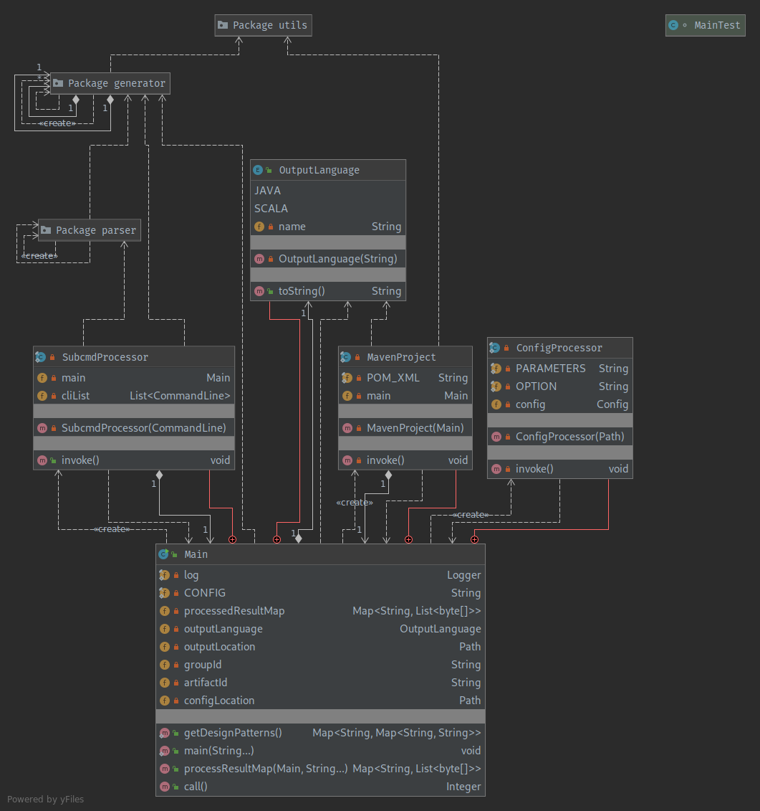
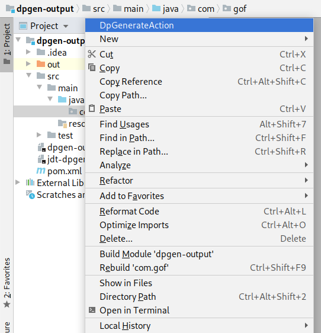

This project implements a cli and an IntelliJ plugin that generates several design patterns 
described in the GoF book. Through the cli or the plugin, users can make a selection of design 
pattern with several configurable options and parameters (including package name, class/interface 
names, datatype and variables names among others). Explanation for each pattern and the relationship
among its reference types can be pulled on demand. The program itself makes use of some of these 
patterns (Builder, Factory Method, Prototype, Observer etc.), both directly and indirectly.


-----
INDEX
-----
1. About Design Patterns
2. Some Important Files
3. Gradle multi project setup details
4. Application Design
    - 4.1 CLI Sub-Project jdt-dpgen-cli
        - 4.1.1 Gathering input from the user
        - 4.1.2 Custom representation for classes and interfaces
        - 4.1.3 The process of generating custom representation from input
        - 4.1.4 Serializing custom representations to java source code
    - 4.2 GUI Sub-Project jdt-dpgen-intellij
        - 4.2.1 Designing GUI
        - 4.2.2 Creating a modal dialog
        - 4.2.3 Setting up model for data exchange
        - 4.2.4 Creating a custom IntelliJ action
5. Setup Instructions
6. Usage Details
    - 6.1 CLI
        - 6.1.1 Available commands and usage help
        - 6.1.2 Passing parameters and options to the cli
        - 6.1.3 Generating multiple design patterns at once
        - 6.1.4 Running from configuration file
    - 6.2 GUI
        - 6.2.1 Step by step guide
        - 6.2.2 Accessing plugin logs and folder 
7. Demo
8. References


------------------------
1. About Design Patterns
------------------------

According to the GoF (Design Patterns: Elements of Reusable Object-Oriented Software) book, 
"a design pattern names, abstracts, and identifies the key aspects of a common design structure that
make it useful for creating a reusable object-oriented design. The design pattern identifies the 
participating classes and instances, their roles and collaborations, and the distribution of 
responsibilities. Each design pattern focuses on a particular object-oriented design problem or 
issue. It describes when it applies, whether it can be applied in view of other design constraints, 
and the consequences and trade-offs of its use".

The design patterns discussed can be categorized into groups (more details in "Usage" Section):

- Creational patterns  
  Creational design patterns abstract the instantiation process.
  They help make a system independent of how its objects are created, composed, and represented.

- Structural patterns  
  Structural patterns are concerned with how classes and objects are composed to form larger 
  structures. Structural class patterns use inheritance to compose interfaces or implementations.

- Behavioural patterns  
  Behavioral patterns are concerned with algorithms and assignment of responsibilities between 
  objects. Behavioral patterns describe not just patterns of objects or classes but also the 
  patterns of communication between them.

These patterns when used correctly can result in cleaner more reusable and maintainable code base, 
however they are not intended to be applied directly in all scenarios without proper consideration 
of the problem at hand. Many times overusing design patterns can lead to abuse. Also, the same 
design pattern may be implemented in a number of ways, each having its merits and demerits. As per 
my understanding, there's a lot of debate on how some of these patterns should be implemented and 
even that some qualify as an Anti-pattern. For example, the Singleton pattern can be implemented in 
any one or combination of the below ways: Eager initialization, Static block initialization, Lazy 
Initialization, hread Safe Singleton, Bill Pugh Singleton Implementation, Using Reflection to 
destroy Singleton Pattern, Enum Singleton, Serialization and Singleton.


-----------------------
2. Some Important Files
-----------------------

    jdt-dpgen-cli/src/main/java/com/ashessin/cs474/hw1
        
        /generator                      sources for represnting custom design pattern refernce types
            /behavioral                     cli and generator classes for behavioral design patterns
            /creational                     cli and generator classes for creational design patterns
            /structural                     cli and generator classes for structural design patterns
        
        /parser                         classes for parsing custom design pattern refernce types
        
        /utils                          helper classes
            FileAuthor.java             saves file (*.java) assuming a maven project structure
            LoggingReflection.java      for logging fields in class files
            MavenInnvoker.java          for invoking mvn command to setup a java/scala project

    src/main/resources/reference.conf   the default configuration file for reference
    
    
    jdt-dpgen-intellij/src/main/java/com/ashessin/cs474/hw2
    
        /action                                   class(es) for extending the intellij action system
        
        /model                                    pojo class(es) for data exchange
        
        /ui                                       sources for gui form and parent intellij dialog 


-------------------------------------
3. Gradle multi project setup details
-------------------------------------

This project is setup as a multi-project gradle build. The root project is `jdt-dpgen` with
sub-projects `jdt-dpgen-cli` and `jdt-dpgen-intellij`. The `jdt-dpgen-cli` sub-project implements 
the CLI. Whereas the `jdt-dpgen-intellij` sub-project implements the IntelliJ plugin and has a 
dependency on `jdt-dpgen-cli`.

Gradle Dependencies for `jdt-dpgen-cli` sub-project:


Gradle Dependencies for `jdt-dpgen-intellij` sub-project:


---------------------
4. Application Design
---------------------

The design pattern generator is built as a command line application and IntelliJ plugin that accepts
user input. The end user may either use the stand-alone cli application or the plugin from within
IntelliJ IDE to generate the design patterns. The application design for both of them are described
below.


---------------------------------
4.1 CLI Sub-Project jdt-dpgen-cli
---------------------------------

For illustration, I am using below arguments to generate the builder pattern for some Employee 
builder design pattern with complex representation (many properties):
Arguments are passed to `com.ashessin.cs474.hw1.Main` class.
(see usage section for details)

```
    -l=scala
    -d=src/main/resources
    builder
    Builder
    EmployeeBuilder
    Employee
    int,age;String,lastName;String,firstName;java.util.List<String>,responsibilities
```


--------------------------------------------------------
4.1.1 Application Design - Gathering input from the user
--------------------------------------------------------

For each design pattern there exists a pair of files within the package names 
`com.ashessin.cs474.hw1.generator.behavioral`, `com.ashessin.cs474.hw1.generator.creational`, 
`com.ashessin.cs474.hw1.generator.structural`.  

The first type of file ending in prefix 'Q' contains the source for parsing the command line input 
and also showing command usage instructions. All of these classes implement the 
`java.util.concurrent.Callable` interface and make use of annotations for making the cli (supported 
through the picocli library). These files are responsible for instantiating their
respective design pattern generator class.  

The second type of files ending in prefix 'Gen' take the parsed cli input and returns a custom 
representation of interface (`DpInterfaceSource`) and class (`DpClassSource`) types associated with 
the design pattern. The representations are specific to each design pattern and capture the 
relationships as per some rules set in the same class body.  

```
22:34:31.035 |     main | INFO  | w1.generator.creational.BuilderQ | Generating representation for design pattern sources.
22:34:31.042 |     main | DEBUG | .generator.creational.BuilderGen | packageName=com.gof.creational.builder
22:34:31.044 |     main | DEBUG | .generator.creational.BuilderGen | abstractBuilderName=Builder
22:34:31.044 |     main | DEBUG | .generator.creational.BuilderGen | concreteBuilderName=EmployeeBuilder
22:34:31.044 |     main | DEBUG | .generator.creational.BuilderGen | concreteProductName=Employee
22:34:31.044 |     main | DEBUG | .generator.creational.BuilderGen | propertiesMap={age=int, lastName=String, firstName=String, responsibilities=java.util.List<String>}
```


---------------------------------------------------------------------------
4.1.2 Application Design - Custom representation for classes and interfaces
---------------------------------------------------------------------------

The custom top-level named reference type representations `DpClassSource` and `DpInterfaceSource`, 
extend the `DpSource` interface and loosely represent a class and an interface along with their 
members. These members can be fields/properties (`DpSourceField`) and methods (`DpSourceMethod`) in 
the case of `DpClassSource` instances or just methods in case of `DpInterfaceSource`. Enums are used
for modeling possible modifier values. All four of these implement a basic inner static Builder 
pattern with mandatory parameters and lazy validation.  
Additionally, to avoid a lot of boilerplate code associated with generating a `DpSourceMethod` when 
representing an override, the `DpSourceMethod` declares a copying builder method (a variation on the
copy constructor, often discussed along with the Prototype design pattern).

It is important to note that these custom representations are quite limiting when compared to what 
one can accomplish within an actual class or interface declaration. For ex: there's no support for 
annotations, parameterized class definitions, inner class etc., just to name a few of those. However
this is not an issue since the user is supposed to extend on these generated design pattern files 
manually later. Also, all of the design patterns can be implemented without the need for supporting 
such extended representations.  


The process of generating custom representation from input  
Lastly, `DpArrayList` extends the `java.util.ArrayList` class and overrides the `add()` method while
also declaring a few other methods that are specific to the derived class. This class can be
instantiated to hold objects of the derived type `DpSource`. This is a convenient data structure to 
pass around since it can hold both the derived types (`DpInterfaceSource`, `DpClassSource`). The 
'Gen' prefix classes make use of `DpArrayList` to add design pattern reference types as they are 
built in their respective `main` method.  

```
22:34:31.065 |     main | DEBUG | .generator.creational.BuilderGen | DpClassSource[packageName='com.gof.creational.builder', name='Employee', javadoc='null', accessModifier=PUBLIC, modifier=NONE, implementsInterfaces=[], extendsClass='Object', methods=[], fields=[DpSourceField[name='age', type='int', value='null', javadoc='null', getter=true, setter=true, modifiers=[], accessModifier=PUBLIC], DpSourceField[name='lastName', type='String', value='null', javadoc='null', getter=true, setter=true, modifiers=[], accessModifier=PUBLIC], DpSourceField[name='firstName', type='String', value='null', javadoc='null', getter=true, setter=true, modifiers=[], accessModifier=PUBLIC], DpSourceField[name='responsibilities', type='java.util.List<String>', value='null', javadoc='null', getter=true, setter=true, modifiers=[], accessModifier=PUBLIC]]]
22:34:31.075 |     main | DEBUG | .generator.creational.BuilderGen | DpClassSource[packageName='com.gof.creational.builder', name='Builder', javadoc='null', accessModifier=PUBLIC, modifier=ABSTRACT, implementsInterfaces=[], extendsClass='Object', methods=[DpSourceMethod[constructor=false, name='buildAge', javadoc='', accessModifier=PUBLIC, modifiers=[ABSTRACT], returnType='Builder', body='null', parameters={age=int}, inherited=false], DpSourceMethod[constructor=false, name='buildLastName', javadoc='', accessModifier=PUBLIC, modifiers=[ABSTRACT], returnType='Builder', body='null', parameters={lastName=String}, inherited=false], DpSourceMethod[constructor=false, name='buildFirstName', javadoc='', accessModifier=PUBLIC, modifiers=[ABSTRACT], returnType='Builder', body='null', parameters={firstName=String}, inherited=false], DpSourceMethod[constructor=false, name='buildResponsibilities', javadoc='', accessModifier=PUBLIC, modifiers=[ABSTRACT], returnType='Builder', body='null', parameters={responsibilities=java.util.List<String>}, inherited=false]], fields=[]]
22:34:31.083 |     main | DEBUG | .generator.creational.BuilderGen | DpClassSource[packageName='com.gof.creational.builder', name='EmployeeBuilder', javadoc='null', accessModifier=PUBLIC, modifier=NONE, implementsInterfaces=[], extendsClass='Builder', methods=[DpSourceMethod[constructor=false, name='buildAge', javadoc='', accessModifier=PUBLIC, modifiers=[NONE], returnType='Builder', body='employee.setAge(age);return this;', parameters={age=int}, inherited=false], DpSourceMethod[constructor=false, name='buildLastName', javadoc='', accessModifier=PUBLIC, modifiers=[NONE], returnType='Builder', body='employee.setLastName(lastName);return this;', parameters={lastName=String}, inherited=false], DpSourceMethod[constructor=false, name='buildFirstName', javadoc='', accessModifier=PUBLIC, modifiers=[NONE], returnType='Builder', body='employee.setFirstName(firstName);return this;', parameters={firstName=String}, inherited=false], DpSourceMethod[constructor=false, name='buildResponsibilities', javadoc='', accessModifier=PUBLIC, modifiers=[NONE], returnType='Builder', body='employee.setResponsibilities(responsibilities);return this;', parameters={responsibilities=java.util.List<String>}, inherited=false]], fields=[DpSourceField[name='employee', type='Employee', value='null', javadoc='null', getter=false, setter=false, modifiers=[], accessModifier=PUBLIC]]]
```


---------------------------------------------------------------------------------
4.1.3 Application Design - Serializing custom representations to java source code 
---------------------------------------------------------------------------------

Ultimately, the custom design pattern type representations need to be converted into actual Java 
source. For this we can use a parser like Javapoet (`com.squareup.javapoet`), JavaParser 
(`com.github.javaparser`), Roaster (`org.jboss.forge.roaster`) or Eclipse JDT (`org.eclipse.jdt`).
For the sake of flexibility, a Factory Method design pattern has been implemented which may be used
by the requester to serialize `DpSource` types into respective Java Source representations with any 
one of the four parsers mentioned above as backend. As for this project, only the Roaster 
implementation is developed and ready for use. Roaster uses Eclipse JDT as a shaded library but is
much easier to use in comparison and provides a fluent interface for building objects.  

```
22:34:31.088 |     main | INFO  |      com.ashessin.cs474.hw1.Main | Processing 1 sub-commands.
22:34:31.092 |     main | INFO  | .cs474.hw1.parser.DpSourceParser | Initializing backend parser.
22:34:31.096 |     main | INFO  | hw1.parser.DpSourceParserRoaster | Initialized new Roaster backend.
22:34:31.097 |     main | INFO  |      com.ashessin.cs474.hw1.Main | Begin processing builder sub-command.
22:34:31.108 |     main | INFO  | hw1.parser.DpSourceParserRoaster | Creating new design pattern class: com.gof.creational.builder.Builder
22:34:31.108 | worker-1 | INFO  | hw1.parser.DpSourceParserRoaster | Creating new design pattern class: com.gof.creational.builder.Employee
22:34:31.108 | worker-2 | INFO  | hw1.parser.DpSourceParserRoaster | Creating new design pattern class: com.gof.creational.builder.EmployeeBuilder
22:34:32.702 |     main | INFO  |      com.ashessin.cs474.hw1.Main | Cease processing builder sub-command.
22:34:32.703 |     main | INFO  |      com.ashessin.cs474.hw1.Main | Processed all sub-commands.
```


For writing the java source files and processing cli results returned from the cli interpretations,
helper classes are employed from the `com.ashessin.cs474.hw1.utils` package. Once the serialization
has been performed, the files are written to the user defined location. The serialization and file 
write operations are done in parallel for multiple files. There's also an attempt to initialize the 
root folder of generated files as a maven project. The project may be further converted to scala 
language through the use of the `scalagen` plugin. Note that the scala conversion is automatic and 
might have some deficiencies in the implementation. The conversion might also fail at times since the 
upstream project has not been updated in years. However, for the most part the conversion goes
through without any issues.  

```
22:34:32.838 |     main | INFO  | essin.cs474.hw1.utils.FileAuthor | Attempting to write new file: src/main/resources/dpgen-output/src/main/java/com/gof/creational/builder/Employee.java
22:34:32.848 |     main | INFO  | essin.cs474.hw1.utils.FileAuthor | Wrote 744 bytes to file.
22:34:32.850 |     main | INFO  | essin.cs474.hw1.utils.FileAuthor | Attempting to write new file: src/main/resources/dpgen-output/src/main/java/com/gof/creational/builder/Builder.java
22:34:32.851 |     main | INFO  | essin.cs474.hw1.utils.FileAuthor | Wrote 337 bytes to file.
22:34:32.852 |     main | INFO  | essin.cs474.hw1.utils.FileAuthor | Attempting to write new file: src/main/resources/dpgen-output/src/main/java/com/gof/creational/builder/EmployeeBuilder.java
22:34:32.852 |     main | INFO  | essin.cs474.hw1.utils.FileAuthor | Wrote 564 bytes to file.
22:34:32.853 |     main | INFO  |      com.ashessin.cs474.hw1.Main | Setting up dpgen-output as new Maven project.
22:34:32.865 |     main | INFO  | sin.cs474.hw1.utils.MavenInvoker | Invoking mvn command: mvn -q archetype:generate \ -DgroupId=com.gof \ -DartifactId=dpgen-output \ -DarchetypeGroupId=pl.org.miki \ -DarchetypeArtifactId=java8-quickstart-archetype \ -DarchetypeVersion=1.0.0 \ -DinteractiveMode=false
22:34:47.253 |     main | INFO  |      com.ashessin.cs474.hw1.Main | Successfully setup dpgen-output as maven project.
22:34:47.253 |     main | INFO  |      com.ashessin.cs474.hw1.Main | Beginning Java to Scala transformation.
22:34:47.254 |     main | INFO  | sin.cs474.hw1.utils.MavenInvoker | Invoking mvn command: mvn -q scalagen:main
22:34:55.928 |     main | INFO  |      com.ashessin.cs474.hw1.Main | Successfully converted dpgen-output source files to scala.
22:34:55.929 |     main | INFO  |      com.ashessin.cs474.hw1.Main | Generated design patterns are available in src/main/resources/dpgen-output directory.
```

The Java output files produced are as follows (available under jdt-dpgen-cli/src/main/resources/dpgen-output):  

Output Java class `com.gof.creational.builder.Builder` 
```java
package com.gof.creational.builder;

import java.util.List;

public abstract class Builder {

	public abstract Builder buildAge(int age);

	public abstract Builder buildLastName(String lastName);

	public abstract Builder buildFirstName(String firstName);

	public abstract Builder buildResponsibilities(List<String> responsibilities);
}
```  

Output Java class `com.gof.creational.builder.Employee` 
```java
package com.gof.creational.builder;

import java.util.List;

public class Employee {

	public int age;
	public String lastName;
	public String firstName;
	public List<String> responsibilities;

	public int getAge() {
		return age;
	}

	public void setAge(int age) {
		this.age = age;
	}

	public String getLastName() {
		return lastName;
	}

	public void setLastName(String lastName) {
		this.lastName = lastName;
	}

	public String getFirstName() {
		return firstName;
	}

	public void setFirstName(String firstName) {
		this.firstName = firstName;
	}

	public List<String> getResponsibilities() {
		return responsibilities;
	}

	public void setResponsibilities(List<String> responsibilities) {
		this.responsibilities = responsibilities;
	}
}
```  

Output Java class `com.gof.creational.builder.EmployeeBuilder`
```java
package com.gof.creational.builder;

import java.util.List;

public class EmployeeBuilder extends Builder {

	public Employee employee;

	public Builder buildAge(int age) {
		employee.setAge(age);
		return this;
	}

	public Builder buildLastName(String lastName) {
		employee.setLastName(lastName);
		return this;
	}

	public Builder buildFirstName(String firstName) {
		employee.setFirstName(firstName);
		return this;
	}

	public Builder buildResponsibilities(List<String> responsibilities) {
		employee.setResponsibilities(responsibilities);
		return this;
	}
}
```  


And for transformed scala code:  

Output Scala class `com.gof.creational.builder.Builder`
```scala
package com.gof.creational.builder

import java.util.List
//remove if not needed
import scala.collection.JavaConversions._

abstract class Builder {

  def buildAge(age: Int): Builder

  def buildLastName(lastName: String): Builder

  def buildFirstName(firstName: String): Builder

  def buildResponsibilities(responsibilities: List[String]): Builder
}
```  

Output Scala class `com.gof.creational.builder.Employee`
```scala
package com.gof.creational.builder

import java.util.List
//remove if not needed
import scala.collection.JavaConversions._

class Employee {

  var age: Int = _

  var lastName: String = _

  var firstName: String = _

  var responsibilities: List[String] = _

  def getAge(): Int = age

  def setAge(age: Int) {
    this.age = age
  }

  def getLastName(): String = lastName

  def setLastName(lastName: String) {
    this.lastName = lastName
  }

  def getFirstName(): String = firstName

  def setFirstName(firstName: String) {
    this.firstName = firstName
  }

  def getResponsibilities(): List[String] = responsibilities

  def setResponsibilities(responsibilities: List[String]) {
    this.responsibilities = responsibilities
  }
}
```  

Output Scala class `com.gof.creational.builder.EmployeeBuilder`
```scala
package com.gof.creational.builder

import java.util.List
//remove if not needed
import scala.collection.JavaConversions._

class EmployeeBuilder extends Builder {

  var employee: Employee = _

  def buildAge(age: Int): Builder = {
    employee.setAge(age)
    this
  }

  def buildLastName(lastName: String): Builder = {
    employee.setLastName(lastName)
    this
  }

  def buildFirstName(firstName: String): Builder = {
    employee.setFirstName(firstName)
    this
  }

  def buildResponsibilities(responsibilities: List[String]): Builder = {
    employee.setResponsibilities(responsibilities)
    this
  }
}
```  

The class `com.ashessin.cs474.hw1.Main` acts as a common entry point to all the sub-commands 
implemented in the class files ending in prefix 'Q'. It's nested classes also coordinates 
parsing config files, writing generated source representations to files and setting up maven 
project as described.




--------------------------------------
4.2 GUI Sub-Project jdt-dpgen-intellij
--------------------------------------

As described earlier this project implements a IntelliJ plugin that makes us of the underlying
cli application to generate design patterns right from the IDE in a project/package. To do this,
we make use of the [IntelliJ Platform SDK](https://www.jetbrains.org/intellij/sdk/docs/intro/welcome.html).


-------------------
4.2.1 Designing GUI
-------------------

To gather input from the user, we need a GUI. For this I have used IntelliJ's inbuilt 
[GUI Designer](https://www.jetbrains.com/help/idea/gui-designer-basics.html) which makes use of
Swing library components. The GUI Designer gives two files, first the UI form file 
`com/ashessin/cs474/hw2/ui/DpGenerateForm.form` which contains the XML representation and the bound
class  `com.ashessin.cs474.hw2.ui.DpGenerateForm`. The bound class file has been further modified to
add listeners, custom components and methods. The GUI Designer and the Form Preview is shown in 
below screenshot.


All Strings are picked up from the `jdt-dpgen-intellij/resources/dp_generate.properties` resource 
file and are not hard-coded. Further, a number of Swing components are generated manually. For example,
the `com.ashessin.cs474.hw2.ui.DpGenerateForm.selectDpComboBox` dropdown combobox is populated
using data from `com.ashessin.cs474.hw1.Main.getDesignPatterns` which is in the other sub-project.
The Listeners ensure that the UI components behaves as per expectations and gather user input.
Their implementation is based on the Observer design pattern. Ultimately, the GUI populates the 
`com.ashessin.cs474.hw2.ui.DpGenerateForm.parameters` property using data from the Form text fields
(`javax.swing.JTextField`) and this represents arguments that will be later passed to 
`com.ashessin.cs474.hw1.Main.processResultMap` method.


-----------------------------
4.2.2 Creating a modal dialog
-----------------------------

The form by itself is of now use and must be contained within an IntelliJ Dialog box. For this, we
extend the [com.intellij.openapi.ui.DialogWrapper](https://www.jetbrains.org/intellij/sdk/docs/user_interface_components/dialog_wrapper.html), 
class through `com.ashessin.cs474.hw2.ui.DpGenerateDialogWrapper` and takes care of initializing the
Form.


----------------------------------------
4.2.3 Setting up model for data exchange
----------------------------------------

The UI Form `com.ashessin.cs474.hw2.ui.DpGenerateForm` and Action class (discussed in next section) 
do not interact directly but make use of a POJO `com.ashessin.cs474.hw2.model.DpGenerate`. The form
class updates an instance of this class with the command (formed based on user input) to be used by the 
`com.ashessin.cs474.hw2.action.DpGenerateAction` class.


---------------------------------------
4.2.4 Creating a custom IntelliJ action
---------------------------------------

The plugin dialog box must appear only on some user action. To accomplish this we
extend the [com.intellij.openapi.actionSystem.AnAction](https://www.jetbrains.org/intellij/sdk/docs/tutorials/action_system/working_with_custom_actions.html#creating-a-custom-action), 
class through `com.ashessin.cs474.hw2.action.DpGenerateAction`.

All custom actions must be resisted with an Action Group, menu or toolbar to which the action is added.
For the plugin, the custom action is registed with the `ProjectViewPopupMenu` group.
 
This extended class is responsible for both, enbling/disabling the action 
(`com.ashessin.cs474.hw2.action.DpGenerateAction.update` method) and executing the action 
(`com.ashessin.cs474.hw2.action.DpGenerateAction.actionPerformed`).
In our case, the action is enabled when the user right-clicks on a package name within the Project's
view. Where as the action execution leads to the following:

  1. Initialization of the dialog box (and hence the containing form)
  2. Execution of obtained command by `com.ashessin.cs474.hw1.Main.processResultMap`
  3. Creation of design pattern files using `com.intellij.openapi.command.WriteCommandAction` and 
     `com.intellij.psi.PsiElement.add`
  4. Opening of files in editor view and notifying users of success/failure


---------------------
5. Setup Instructions
---------------------

1. Clone this repository using `git clone https://asing80@bitbucket.org/asing80/cs474-hw2.git`
command.

2. For using `jdt-dpgen-cli` project as a stand-alone cli application, make sure you have maven 
installed and the `MAVEN_HOME`, `M2_HOME` environment variables point to the correct maven install 
location. On most Linux systems, `/usr/share/maven`. This can be check by using `echo $MAVEN_HOME` 
and `echo $M2_HOME` if running from a terminal. If you skip this step, the application would still
work with limited functionality (ie. without scala code generation)

3. Change directory to the locally cloned repository, `cd cs474-hw2`.

4. Run a gradle build along with test cases `gradlew clean build` or `./gradlew clean build`.

5. Optionally, you may want to import the project to IntelliJ, while doing so, please make sure that
your "Build & Run" settings are set to use Gradle and not IntelliJ under settings `File | Settings |
Build, Execution, Deployment | Build Tools | Gradle`. Also make sure that "Binary class files" is 
selected under `File | Settings | Editor | GUI Designer`.


----------------
6. Usage Details
----------------

The user can invoke the design pattern generator by using appropriate options and parameters on the 
command line or make use of the GUI through the IntelliJ Plugin. Some example usages have been 
provided for reference below for both.


-------
6.1 CLI
-------


-------------------------------------------------------
6.1.1 Usage Details - Available commands and usage help
-------------------------------------------------------

To run the cli from jar file, use: `java -jar jdt-dpgen-assembly-0.1.jar -h` (shows below usage help)  
See cs474-hw1 for jar file.

```
Usage: jdt-dpgen [-hV] [-c[=<configFile>]] [-a=<artifactId>] [-d=<outputLocation>] [-g=<groupId>] 
                 [-l=<outputLanguage>] COMMAND COMMAND...

Generates GOF design patterns in Java and Scala language.

  -l, --outputLanguage=<outputLanguage>
                                          The output language for the implement.
                                            Candidates: java, scala
                                            Default: java
  -d, --outputLocation=<outputLocation>
                                          The folder/directory location for saving generated
                                            files.
                                            Default: ${sys:user.dir}
  -a, --artifactId=<artifactId>
                                          Unique base name of the primary artifact being
                                            generated.
                                            Default: dpgen-output
  -g, --groupId=<groupId>
                                          Unique identifier of the organization or group.
                                            Default: com.gof
  -c, --config[=<configFile>]
                                          Path to input configuration file.
  -h, --help                              Show this help message and exit.
  -V, --version                           Print version information and exit.

Commands:
  singleton...............................Generates Singleton creational design pattern. Ensure
                                            a class only has one instance, and provide a global
                                            point of access to it.
  prototype...............................Generates Prototype creational design pattern. Specify
                                            the kinds of objects to create using a prototypical
                                            instance, and create new objects by copying this
                                            prototype.
  builder.................................Generates Builder creational design pattern. Separate
                                            the construction of a complex object from its
                                            representation so that the same construction process
                                            can create different representations.
  factorymethod...........................Generates Factory Method creational design pattern.
                                            Define an interface for creating an object, but let
                                            subclasses decide which class to instantiate.
                                            Factory Method lets a class defer instantiation to
                                            subclass
  abstractfactory.........................Generates Abstract Factory creational design pattern.
                                            Provide an interface for creating families of
                                            related or dependent objects without specifying
                                            their concrete classes.
  adapter.................................Generates Adapter structural design pattern. Convert
                                            the interface of a class into another interface
                                            clients expect. Adapter lets classes work together
                                            that couldn't otherwise because of incompatible
                                            interfaces.
  bridge..................................Generates Bridge structural design pattern. Decouple
                                            an abstraction from its implementation so that the
                                            two can vary independently.
  composite...............................Generates Composite structural design pattern. Compose
                                            objects into tree structures to represent part-whole
                                            hierarchies. Composite lets clients treat individual
                                            objects and compositions of objects uniformly.
  decorator...............................Generates Decorator structural design pattern. Attach
                                            additional responsibilities to an object
                                            dynamically. Decorators provide a flexible
                                            alternative to sub-classing for extending
                                            functionality.
  facade..................................Generates Facade structural design pattern. Provide a
                                            unified interface to a set of interfaces in a
                                            subsystem. Facade defines a higher-level interface
                                            that makes the subsystem easier to use.
  flyweight...............................Generates Flyweight structural design pattern. Use
                                            sharing to support large numbers of fine-grained
                                            objects efficiently.
  proxy...................................Generates Proxy structural design pattern. Provide a
                                            surrogate or placeholder for another object to
                                            control access to it.
  chainofresponsibility...................Generates Chain Of Responsibility behavioral design
                                            pattern. Avoid coupling the sender of a request to
                                            its receiver by giving more than one object a chance
                                            to handle the request. Chain the receiving objects
                                            and pass the request along the chain until an object
                                            handles it.
  command.................................Generates Command behavioral design pattern.
                                            Encapsulate a request as an object, thereby letting
                                            you parameterize clients with different requests,
                                            queue or log requests, and support undoable
                                            operations.
  interpreter.............................Generates Interpreter behavioral design pattern. Given
                                            a language, define a representation for its grammar
                                            along with an interpreter that uses the
                                            representation to interpret sentences in the
                                            language.
  iterator................................Generates Iterator behavioral design pattern. Provide
                                            a way to access the elements of an aggregate object
                                            sequentially without exposing its underlying
                                            representation.
  mediator................................Generates Mediator behavioral design pattern. Define
                                            an object that encapsulates how a set of objects
                                            interact. Mediator promotes loose coupling by
                                            keeping objects from referring to each other
                                            explicitly, and it lets you vary their interaction
                                            independently.
  memento.................................Generates Memento behavioral design pattern. Without
                                            violating encapsulation, capture and externalize an
                                            object’s internal state so that the object can be
                                            restored to this state later.
  observer................................Generates Observer behavioral design pattern. Define a
                                            one-to-many dependency between objects so that when
                                            one object changes state, all its dependents are
                                            notified and updated automatically.
  state...................................Generates State behavioral design pattern. Allow an
                                            object to alter its behavior when its internal state
                                            changes. The object will appear to change its class
  strategy................................Generates Strategy behavioral design pattern. Define a
                                            family of algorithms, encapsulate each one, and make
                                            them interchangeable. Strategy lets the algorithm
                                            vary independently from clients that use it.
  templatemethod..........................Generates Template Method behavioral design pattern.
                                            Define the skeleton of an algorithm in an operation,
                                            deferring some steps to subclasses. Template Method
                                            lets subclasses redefine certain steps of an
                                            algorithm without changing the algorithm’s structure.
  visitor.................................Generates Visitor behavioral design pattern. Represent
                                            an operation to be performed on the elements of an
                                            object structure. Visitor lets you define a new
                                            operation without changing the classes of the
                                            elements on which it operates.

```

You can also get usage help for specific design pattern subcommand, say the Builder pattern to get
what options, paramters are avaialble.  

`java -jar jdt-dpgen-assembly-0.1.jar builder -h` (shows usage help for builder design pattern)


```
Usage: dpgen builder [BuilderName ConcreteBuilderName ConcreteProductName ConcreteProductProperties]
                     [-hV] [-p=<packageName>]

Generates Builder creational design pattern. Separate the construction of a complex object from its 
representation so that the same construction process can create different representations.

      BuilderName                         The Builder specifies an abstract interface for
                                            creating parts of a Product object.
                                            Default: Builder
      ConcreteBuilderName                 The ConcreteBuilder class constructs and assembles
                                            parts of the product, implementing the Builder
                                            interface.
                                            Default: ConcreteBuilder
      ConcreteProductName                 The Product class represents a complex object.
                                            Default: Product
      ConcreteProductProperties
                                            Default: Object,property1;Object,property2
  -p, --packageName=<packageName>
                                            Default: com.gof.creational.builder
  -h, --help                                Show this help message and exit.
  -V, --version                             Print version information and exit.
```

---------------------------------------------------------------
6.1.2 Usage Details - Passing parameters and options to the cli
---------------------------------------------------------------

Notice that each command has default parameters and options already set and will use those in case 
the user provides none. An example run of builder pattern genrator with user provided input was 
already shown in the Application Design section. However, for non customized implementation, one 
could also use:  

```
    -l=scala
    -d=jdt-dpgen-cli/src/main/resources
    builder
```

Above we do not provide the cli with BuilderName, ConcreteBuilderName, ConcreteProductName, 
ConcreteProductProperties paramters however, since the default values are avilable, they are used
instead.

-----------------------------------------------------------------
6.1.3 Usage Details - Generating multiple design patterns at once
-----------------------------------------------------------------

If more than one design patterns need to be generated within the same package, that can be done by 
passing them all at once to the cli.  

    -l=scala
    -d=jdt-dpgen-cli/src/main/resources
    builder
    anstractfactory
    strategy

To generate all the design patterns from the jar file use:

```
dpgen \
    singleton prototype builder factorymethod abstractfactory \
    adapter bridge composite decorator facade flyweight proxy \
    chainofresponsibility command interpreter iterator mediator memento observer state strategy templatemethod visitor
```

where dpgen is an alias, something like:  

    alias dpgen="/usr/lib/jvm/java-13/bin/java --enable-preview -jar jdt-dpgen-assembly-0.1.jar"

-----------------------------------------------------
6.1.4 Usage Details - Running from configuration file
-----------------------------------------------------

To run from configuration file, use the `-c` option followed by the path to the configuration file.  

    java -jar jdt-dpgen-assembly-0.1.jar -c /path/to/configuration-file.conf

If no path is passes, the application tries to use the default internal configuration file.  

    java -jar jdt-dpgen-assembly-0.1.jar -c


-------
6.2 GUI
-------


------------------------
6.2.1 Step by step guide
------------------------

Since the IntelliJ plugin is unpublished, it can't be obtained from the IntelliJ Plugin Marketplace.
Instead we use gradle to run the Intellij plugin in a sandbox environment. To do this, change to the
cloned repository and use gradle task `runIde`.

    cd cs474-hw2; ./gradlew jdt-dpgen-intellij:runIde

   or

    cd cs474-hw2; gradlew jdt-dpgen-intellij:runIde

This should start the sandboxed IntelliJ IDE. Next, we need to create a new Java project.
If you are new to the IntelliJ IDE, follow this guide: [Create your first Java application
](https://www.jetbrains.com/help/idea/creating-and-running-your-first-java-application.html).
You may also setup the project using Maven or Gradle within the IDE.


Next, create a new Java package, here we are using `com.gof` as an example.


Right-click on the package, and select custom plugin action "DpGenerateAction".



After the above acton, a dialog box will pop-up with the available design pattern creation methods.


You can either select a design patter from the dopdown or use cli command. Here I am using the
dropdown which populates a number of pre-filled fields for the selected design pattern.
I have customized these fields to replicate the Builder example discussed in section 4.1 above


Click "Ok" to confirm your selection and the design pattern files will be generated. You will also 
receive a sticky notification on completion and the generated files open up in the editor for
further customization/inspection.


--------------------------------------
6.2.2 Accessing plugin logs and folder
--------------------------------------

You may access logs by using the `Help | Show Log in Files` option. More details are avaialble on
on this article: [Locating IDE log files](https://intellij-support.jetbrains.com/hc/en-us/articles/207241085-Locating-IDE-log-files).
Note that by default, IDE logging is set to `INFO` level. Further, details on getting to the plugin folder 
are described here: [Development Instance Settings, Caches, Logs, and Plugins](https://www.jetbrains.org/intellij/sdk/docs/basics/ide_development_instance.html#development-instance-settings-caches-logs-and-plugins).


-------
7. Demo
-------

https://asing80.people.uic.edu/cs474/hw2


-------------
8. References
-------------

  1. http://www.design-patterns-stories.com/
  2. https://github.com/TomerFi/design-patterns-examples
  3. https://sourcemaking.com/design_patterns
  4. https://refactoring.guru/design-patterns
  5. https://www.oodesign.com/
  6. https://www.journaldev.com/1377/java-singleton-design-pattern-best-practices-examples
  7. http://hrabosch.com/2017/07/16/intellij-platform-plugin-development-example-1-generate-class-from-template/
  8. https://www.plugin-dev.com/intellij-notifications.pdf